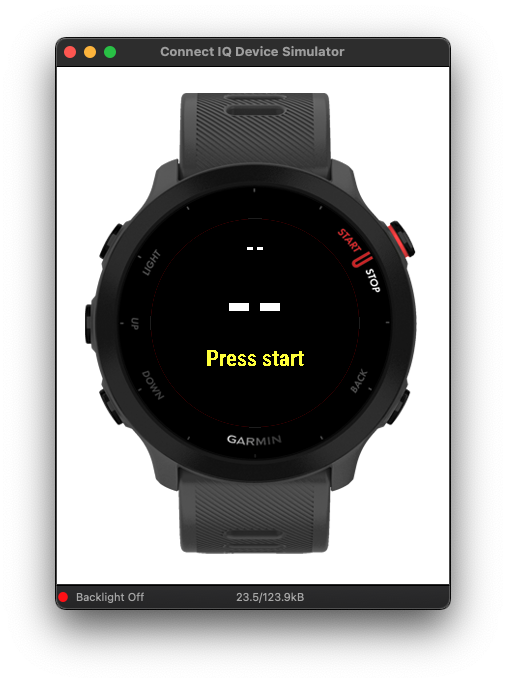
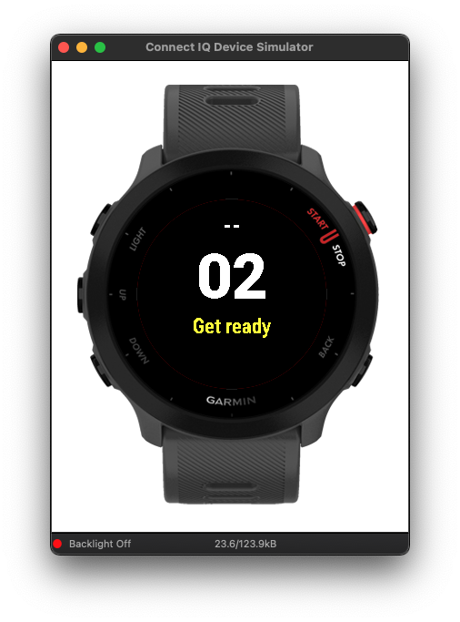
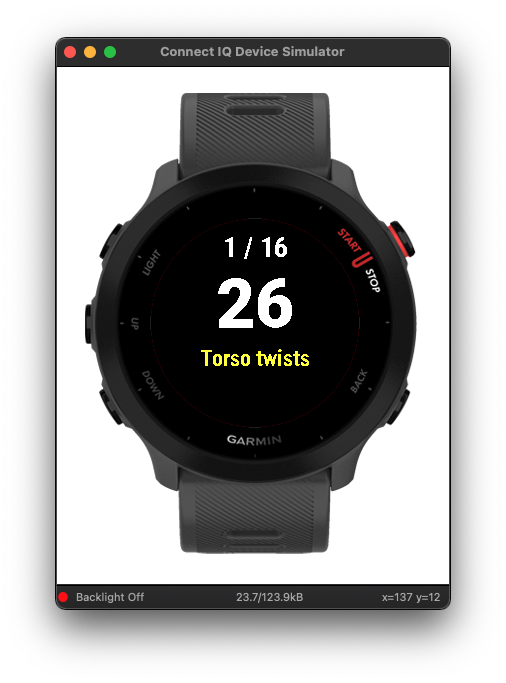
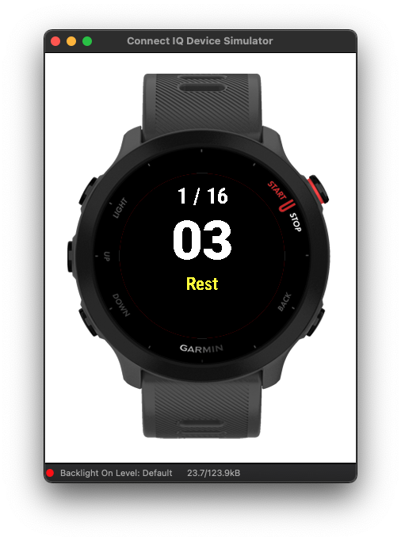

# Workouts app for Garmin watches

The goal is to have warm-up, cooldown, and stretching procedures available in a single application.

Based on the abandoned [7-Minute Workout (HICT)](https://bitbucket.org/obagot/connectiq-hict/src/master/) app.

At the moment only compatible with the Forerunner 55 watch.

- [Warm-up procedure](./warm-up)
- [Cooldown procedure](./cooldown)
